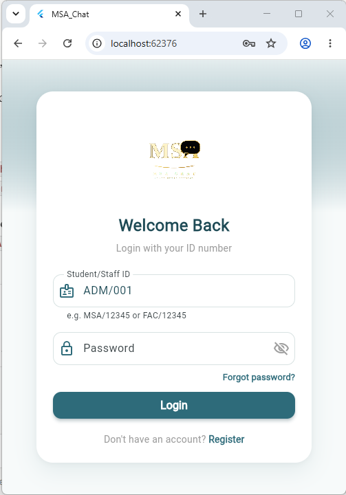
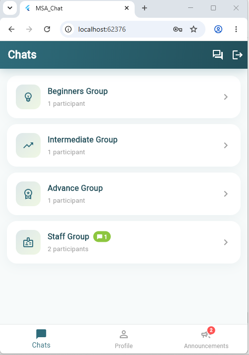
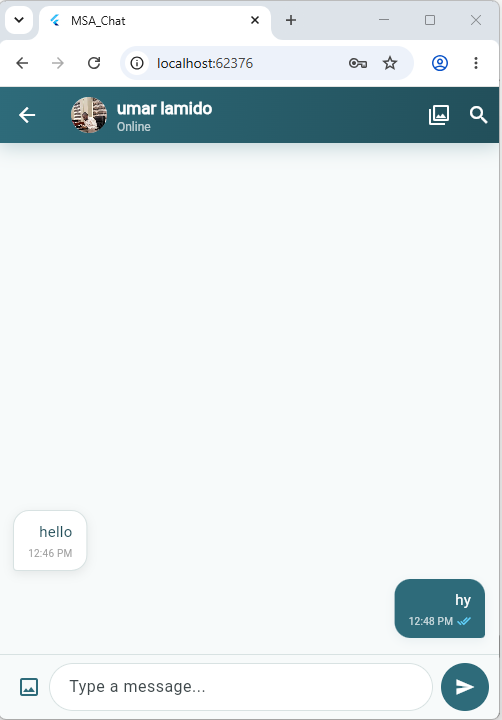
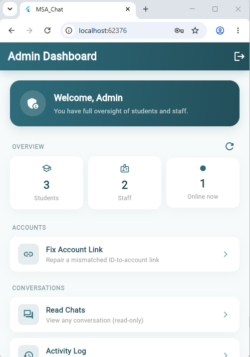

# \# MSA\_Chat

## 

##### A group messaging and announcement app for \*\*Muhab Skills Academy\*\*, built with \*\*Flutter\*\* and \*\*Firebase\*\*. It runs on Chrome (web) and Android.

##### 

##### I built this as a personal challenge: to see whether I could design and ship a complete, role-based chat platform on my own, from login to security rules to an admin console.

## 

<p align="center">


&#x20; 


&#x20; 


&#x20; 


&#x20; 


</p>


\## Features


\### For everyone


\\\* \\\*\\\*ID-based login\\\*\\\* using academy IDs (MSA / FAC format)
\\\* \\\*\\\*1-on-1 real-time chat\\\*\\\* with read receipts, typing indicators, replies, message editing and deletion, emoji reactions, and pinned messages
\\\* \\\*\\\*Photo sharing\\\*\\\* with a shared-photos gallery per conversation
\\\* \\\*\\\*Chat list\\\*\\\* with search, pinning, muting and unread badges
\\\* \\\*\\\*Profiles\\\*\\\*: edit your own, view anyone else's (read-only)
\\\* \\\*\\\*Group lists\\\*\\\* (Beginners, Intermediate, Advance) to find classmates
\\\* \\\*\\\*Announcements\\\*\\\* from staff, with unread badges
\\\* \\\*\\\*Dark mode\\\*\\\*, remembered between sessions

### For staff

\\\* Send broadcast announcements
\\\* Edit student details and move students between groups

### For the admin

A single admin account, created outside the public sign-up flow.

\\\* \\\*\\\*Dashboard\\\*\\\* with live counts (students, staff, online now) and searchable account lists
\\\* \\\*\\\*Account management\\\*\\\*: edit any account, make someone staff or student, disable or re-enable an account, send a password reset email
\\\* \\\*\\\*Fix Account Link\\\*\\\*: repairs ID-to-account mismatches
\\\* \\\*\\\*Chat reader\\\*\\\*: read-only view of every conversation, filterable by group and searchable by name. It does not mark messages as read or show typing indicators.
\\\* \\\*\\\*Activity Log\\\*\\\*: a permanent record of every conversation the admin opens

## Security design

\\\* \\\*\\\*Roles\\\*\\\*: student, staff, and one admin. The admin is identified by a \\\*\\\*hardcoded UID\\\*\\\* checked inside the Firestore rules, never by a field a user could write to.
\\\* \\\*\\\*Firestore rules\\\*\\\* cover every collection and deny everything by default.
\\\* \\\*\\\*Disabled accounts\\\*\\\* are blocked at login, signed out live, and rejected by the rules.
\\\* \\\*\\\*The audit log is tamper-proof\\\*\\\*: entries carry the real server time and can never be edited or deleted, even by the admin.
\\\* Only the admin can read or write the account-link index; staff cannot change roles.

## Tech stack

|Area|Tools|
|-|-|
|App|Flutter (Dart)|
|Auth|Firebase Authentication|
|Database|Cloud Firestore|
|Local settings|shared\\\\\\\_preferences|
|Photos|image\\\\\\\_picker, stored as base64 inside Firestore|

## Project structure

```
lib/
  main.dart                      App entry, theme, shared UI helpers
  login\\\\\\\\\\\\\\\_screen.dart              ID-based login
  register\\\\\\\\\\\\\\\_screen.dart           Sign-up
  role\\\\\\\\\\\\\\\_service.dart              Decides student / staff / admin
  post\\\\\\\\\\\\\\\_login\\\\\\\\\\\\\\\_navigation.dart     Sends each role to the right screen
  chats\\\\\\\\\\\\\\\_list\\\\\\\\\\\\\\\_screen.dart         Chat list
  chat\\\\\\\\\\\\\\\_screen.dart               1-on-1 chat
  group\\\\\\\\\\\\\\\_screen.dart              Group member lists
  profile\\\\\\\\\\\\\\\_screen.dart            Profiles
  broadcasts\\\\\\\\\\\\\\\_screen.dart         Announcements
  send\\\\\\\\\\\\\\\_notification\\\\\\\\\\\\\\\_screen.dart  Send an announcement
  admin\\\\\\\\\\\\\\\_dashboard\\\\\\\\\\\\\\\_screen.dart    Admin home
  account\\\\\\\\\\\\\\\_list\\\\\\\\\\\\\\\_screen.dart       Searchable account lists
  user\\\\\\\\\\\\\\\_record\\\\\\\\\\\\\\\_screen.dart        View / edit one account
  fix\\\\\\\\\\\\\\\_account\\\\\\\\\\\\\\\_link\\\\\\\\\\\\\\\_screen.dart   Repair ID links
  admin\\\\\\\\\\\\\\\_chat\\\\\\\\\\\\\\\_reader\\\\\\\\\\\\\\\_screen.dart  Read-only chat viewer
  admin\\\\\\\\\\\\\\\_activity\\\\\\\\\\\\\\\_log\\\\\\\\\\\\\\\_screen.dart Audit log viewer
firestore.rules                  Security rules
```

## Running it yourself

1. Install \\\[Flutter](https://docs.flutter.dev/get-started/install).
2. Create a Firebase project and enable \\\*\\\*Authentication\\\*\\\* (Email/Password) and \\\*\\\*Cloud Firestore\\\*\\\*.
3. Connect the app to your project with `flutterfire configure`. This regenerates `lib/firebase\\\\\\\\\\\\\\\_options.dart`.
4. Create your admin account in Firebase Authentication and copy its UID into \\\*\\\*both\\\*\\\*:

   \\\* `lib/app\\\\\\\\\\\\\\\_constants.dart` (`adminUid`)
\\\* the `isAdmin()` function in `firestore.rules`

5. Publish `firestore.rules` in the Firebase console.
6. Run `flutter pub get`, then `flutter run -d chrome` (or pick an Android device).

## Known limitations

These are deliberate trade-offs for a project that runs on Firebase's free plan:

\\\* \\\*\\\*No push notifications.\\\*\\\* Background push needs Cloud Functions, which requires a paid Firebase plan. Notifications appear only while the app is open.
\\\* \\\*\\\*Photos are stored as base64 in Firestore\\\*\\\*, capped at about 650 KB each, instead of Firebase Storage (which also requires a paid plan).
\\\* \\\*\\\*The ID lookup collection is publicly readable\\\*\\\*, which login needs. Firebase App Check would tighten this and is a planned improvement.
\\\* \\\*\\\*Admins can read all chats.\\\*\\\* Every access is logged, but anyone deploying this for real users should say so in their privacy notice.

## Roadmap

\\\* Firebase App Check
\\\* Privacy notice screen at sign-up
\\\* Splitting the largest screens into smaller files
\\\* Automated tests for the security rules

